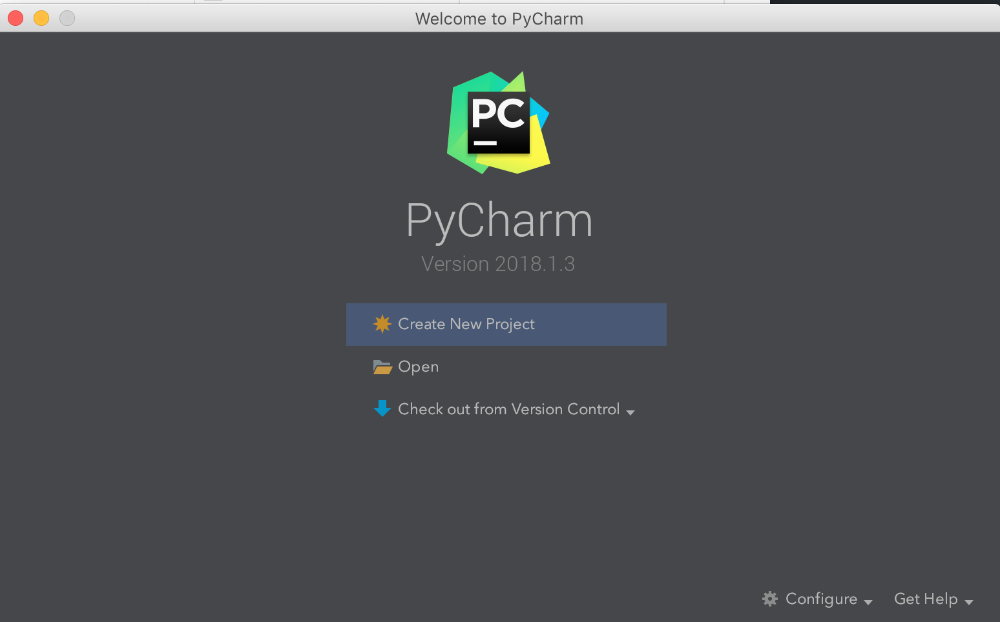

## 初识 Python
### Python简介
#### Python的历史
1. 1989 年圣诞节：Guido von Rossum 开始写 Python 语言的编译器。
2. 1991 年 2 月：第一个 Python 编译器（同时也是解释器）诞生，它是用 C 语言实现的（后面又出现了 Java 和 C# 实现的版本 Jython 和 IronPython，以及 PyPy、Brython、Pyston 等其他实现），可以调用 C 语言的库函数。在最早的版本中，Python 已经提供了对“类”，“函数”，“异常处理”等构造块的支持，同时提供了“列表”和“字典”等核心数据类型，同时支持以模块为基础的拓展系统。
3. 1994 年 1 月：Python 1.0 正式发布。
4. 2000 年 10 月 16 日：Python 2.0发 布，增加了实现完整的[垃圾回收](https://zh.wikipedia.org/wiki/%E5%9E%83%E5%9C%BE%E5%9B%9E%E6%94%B6_(%E8%A8%88%E7%AE%97%E6%A9%9F%E7%A7%91%E5%AD%B8))，提供了对[Unicode](https://zh.wikipedia.org/wiki/Unicode)的支持。与此同时，Python 的整个开发过程更加透明，社区对开发进度的影响逐渐扩大，生态圈开始慢慢形成。
5. 2008 年 12 月 3 日：Python 3.0 发布，它并不完全兼容之前的 Python 代码，不过因为目前还有不少公司在项目和运维中使用 Python 2.x 版本，所以Python 3.x 的很多新特性后来也被移植到 Python 2.6/2.7 版本中。

目前我们使用的 Python 3.7.x 的版本是在 2018 年发布的，Python 的版本号分为三段，形如 A.B.C。其中 A 表示大版本号，一般当整体重写，或出现不向后兼容的改变时，增加 A；B 表示功能更新，出现新功能时增加 B；C 表示小的改动（如修复了某个 Bug），只要有修改就增加 C。如果对 Python 的历史感兴趣，可以查看一篇名为[《Python简史》](http://www.cnblogs.com/vamei/archive/2013/02/06/2892628.html)的博文。

#### Python的优缺点

Python 的优点很多，简单的可以总结为以下几点。

1. 简单和明确，做一件事只有一种方法。
2. 学习曲线低，跟其他很多语言相比，Python 更容易上手。
3. 开放源代码，拥有强大的社区和生态圈。
4. 解释型语言，天生具有平台可移植性。
5. 支持两种主流的编程范式（面向对象编程和函数式编程）都提供了支持。
6. 可扩展性和可嵌入性，可以调用 C/C++ 代码，也可以在 C/C++ 中调用 Python。
7. 代码规范程度高，可读性强，适合有代码洁癖和强迫症的人群。

Python 的缺点主要集中在以下几点。

1. 执行效率稍低，因此计算密集型任务可以由 C/C++ 编写。
2. 代码无法加密，但是现在的公司很多都不是卖软件而是卖服务，这个问题会被淡化。
3. 在开发时可以选择的框架太多（如 Web 框架就有 100 多个），有选择的地方就有错误。

#### Python的应用领域

目前 Python 在云基础设施、DevOps、网络爬虫开发、数据分析挖掘、机器学习等领域都有着广泛的应用，因此也产生了 Web 后端开发、数据接口开发、自动化运维、自动化测试、科学计算和可视化、数据分析、量化交易、机器人开发、图像识别和处理等一系列的职位。

### 搭建编程环境

#### MacOS环境

macOS 也是自带了 Python 2.x 版本的，可以通过 [Python 的官方网站](https://www.python.org) 提供的安装文件（pkg文件）安装 3.x 的版本。默认安装完成后，可以通过在终端执行 python 命令来启动 2.x 版本的 Python 解释器，可以通过执行 python3 命令来启动 3.x 版本的 Python 解释器。

### 从终端运行Python程序

#### 确认Python的版本

在终端或命令行提示符中键入下面的命令。

```Shell
python --version
```
当然也可以先输入 python 进入交互式环境，再执行以下的代码检查 Python 的版本。

```Python
import sys

print(sys.version_info)
print(sys.version)
```

#### 编写Python源代码

可以用文本编辑工具（推荐使用 Sublime、Atom、TextMate、VSCode 等高级文本编辑工具）编写 Python 源代码并将其命名为 hello.py 保存起来，代码内容如下所示。

```Python
print('hello, world!')
```

#### 运行程序

切换到源代码所在的目录并执行下面的命令，看看屏幕上是否输出了 "hello, world!"。

```Shell
python hello.py
```

### 代码中的注释

注释是编程语言的一个重要组成部分，用于在源代码中解释代码的作用从而增强程序的可读性和可维护性，当然也可以将源代码中不需要参与运行的代码段通过注释来去掉，这一点在调试程序的时候经常用到。注释在随源代码进入预处理器或编译时会被移除，不会在目标代码中保留也不会影响程序的执行结果。

1. 单行注释 - 以 # 和空格开头的部分
2. 多行注释 - 三个引号开头，三个引号结尾

```Python
print('Hello World')
print('你好，世界')
```

### 其他工具介绍

#### IDLE - 自带的集成开发工具

IDLE是安装Python环境时自带的集成开发工具，如下图所示。但是由于IDLE的用户体验并不是那么好所以很少在实际开发中被采用。


#### PyCharm - Python开发神器

PyCharm 的安装、配置和使用在[《玩转PyCharm》](https://github.com/jackfrued/Python-100-Days/edit/master/%E7%8E%A9%E8%BD%ACPyCharm.md)进行了介绍，有兴趣的读者可以选择阅读。



### 练习

1. 在 Python 交互环境中查看下面的代码结果，并将内容翻译成中文。

只需要在 Python 交互环境中 import this 并运行就可以得到如下内容

```
The Zen of Python, by Tim Peters
    
Beautiful is better than ugly.
Explicit is better than implicit.
Simple is better than complex.
Complex is better than complicated.
Flat is better than nested.
Sparse is better than dense.
Readability counts.
Special cases aren't special enough to break the rules.
Although practicality beats purity.
Errors should never pass silently.
Unless explicitly silenced.
In the face of ambiguity, refuse the temptation to guess.
There should be one-- and preferably only one --obvious way to do it.
Although that way may not be obvious at first unless you're Dutch.
Now is better than never.
Although never is often better than *right* now.
If the implementation is hard to explain, it's a bad idea.
If the implementation is easy to explain, it may be a good idea.
Namespaces are one honking great idea -- let's do more of those!

```
该段内容是 Tim Peters 所做的 Python 之禅，Google 翻译如下：


```
Python 之禅 By Tim Peters
    
美丽胜过丑陋。
显式优于隐式。
简单比复杂更好。
复杂比复杂更好。
Flat优于嵌套。
稀疏优于密集。
可读性很重要。
特殊情况不足以打破规则。
虽然实用性胜过纯洁。
错误不应该默默地传递。
除非明确沉默。
面对模棱两可，拒绝猜测的诱惑。
应该有一个 - 最好只有一个 - 明显的方法来做到这一点。
虽然这种方式起初可能并不明显，除非你是荷兰人。
现在比永远好。
虽然现在永远不会比*正确好。
如果实施很难解释，这是一个坏主意。
如果实现很容易解释，那可能是个好主意。
命名空间是一个很棒的主意 - 让我们做更多的事情吧！
```


2. 学习使用 turtle 在屏幕上绘制图形。

```Python
import turtle

turtle.pensize(4)
turtle.pencolor('red')
turtle.forward(100)
turtle.right(90)
turtle.forward(100)
turtle.right(90)
turtle.forward(100)
turtle.right(90)
turtle.forward(100)
turtle.mainloop()
```
